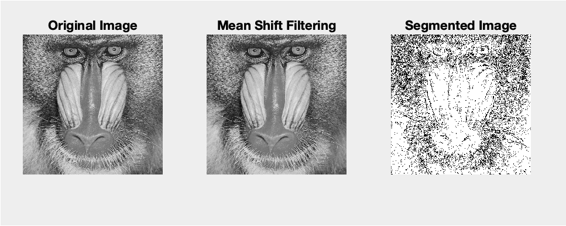

# 🧠 Object Segmentation using Mean Shift

This project implements the **Mean Shift algorithm from scratch** to perform **image segmentation** on grayscale images, specifically using the Baboon image as a primary example. The algorithm was built based on both conceptual and mathematical foundations discussed during the course, with a focus on simplifying the feature space by starting in grayscale.

---

## 📁 Project Overview

**Mean Shift** is a non-parametric clustering algorithm used for feature space analysis and image segmentation. In this project, it is used to group pixels based on intensity and spatial proximity.

The goal is to segment an image into regions of similar intensity by shifting each pixel to the local maxima of the feature space density function.

---

## 🛠️ Methodology

### 1. Feature Vector Construction
Each pixel is represented using a feature vector of the form:
[x, y, intensity]

where:
- `x` and `y` are spatial coordinates
- `intensity` is the grayscale value (0–255)

### 2. Mean Shift Filtering
- The algorithm iteratively shifts each pixel's feature vector to the weighted mean of its neighbors within a fixed **bandwidth `h`**
- The shift continues until the movement is less than a **threshold `TH`** or a **maximum iteration limit** is reached

### 3. Clustering
- After convergence, pixels are grouped into clusters based on their convergence points
- Unique labels are assigned to each cluster
- A small region filter is applied to discard noisy or insignificant segments

### 4. Runtime Feedback
- Progress updates are printed to the terminal every **5000 pixels** to monitor performance

---

## 🧪 Dataset

### 🖼️ Color Images
- **Baboon, Lena, Pepper**
- Each pixel is a 3D feature vector: `[R, G, B]`
- Feature space: **3D color histogram** or extended **5D (R, G, B, x, y)** for joint spatial-color analysis

### 🖤 Grayscale Images
- **Baboon, Lena, Pepper, Barbara, Cameraman, Goldhill**
- Each pixel is a 1D intensity value
- Feature space: **1D histogram of intensities** or extended **3D (x, y, intensity)**

---

## 📈 Observations & Bandwidth Tuning

- **Small Bandwidth:** Leads to many small clusters; can oversegment the image
- **Large Bandwidth:** May merge distinct regions; oversimplifies structures
- **Balanced Bandwidth:** Reveals key image structures (e.g., eyes, nose) while reducing noise

The choice of bandwidth greatly influences:
- Convergence speed
- Number and quality of detected segments
- Visual sharpness and abstraction of the result

---

## 📸 Output Example

Below is a sample output of the segmented image using Mean Shift on the grayscale Baboon image:

---

## 📚 Reference

> **D. Comaniciu, P. Meer**,  
> *Mean Shift: A Robust Approach toward Feature Space Analysis*  
> IEEE Transactions on Pattern Analysis and Machine Intelligence, Vol. 24, No. 5, pp. 603–619, 2002.

---

## 🔧 Requirements

- MATLAB (tested with R2021a or newer)
- Image Processing Toolbox
- Compatible grayscale or RGB images

---

